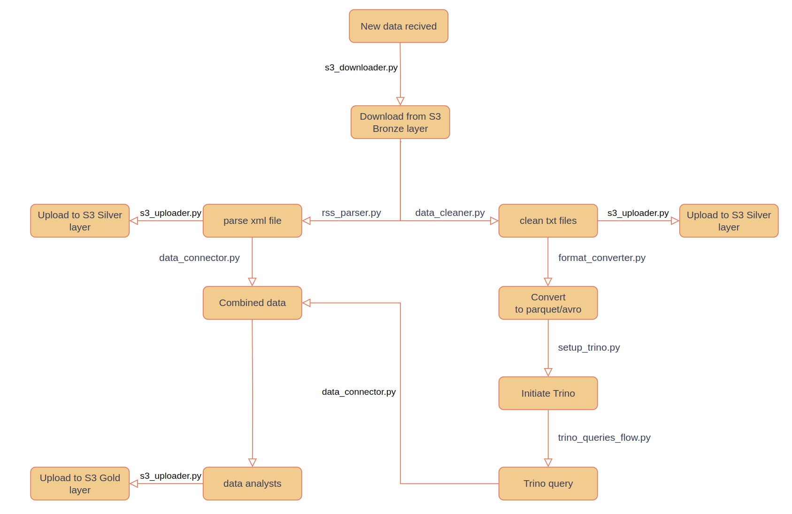

# Data Processing Flow Project

This project implements an automated data processing pipeline that downloads data from an S3 Bronze layer, processes it through various transformations, and ultimately uploads the results to Silver and Gold S3 layers while also enabling Trino queries.

## Overview

The pipeline follows a structured flow for ETL (Extract, Transform, Load) processing:

1. Data is downloaded from the S3 Bronze layer
2. Processing occurs in parallel branches:
   - XML files are parsed and uploaded to the Silver layer
   - Text files are cleaned and uploaded to the Silver layer, then converted to Parquet/Avro format
3. Trino queries are enabled for data access
4. Data is combined and analyzed
5. Analyzed data is uploaded to the Gold layer

## Components

The project consists of the following Python modules:

- **s3_downloader.py**: Downloads data from the S3 Bronze layer
- **rss_parser.py**: Parses XML files from the downloaded data
- **data_cleaner.py**: Cleans and processes text files
- **s3_uploader.py**: Handles uploads to S3 Silver and Gold layers
- **data_connector.py**: Combines data from different processing branches
- **format_converter.py**: Converts data to Parquet/Avro format
- **setup_trino.py**: Initializes Trino for data querying
- **trino_queries_flow.py**: Executes queries against the processed data
- **main.py**: Orchestrates the entire data flow process

